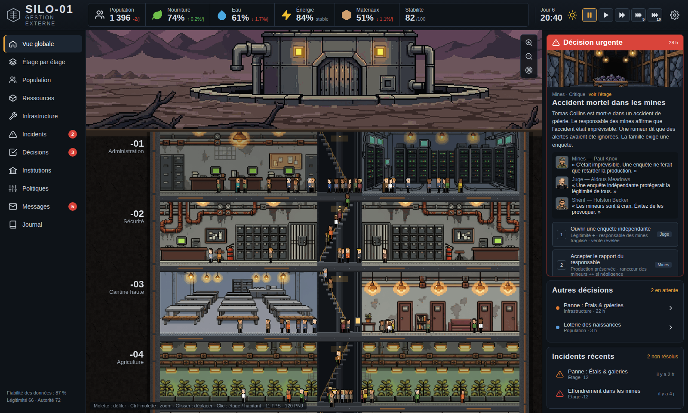

# SILO-01 — Gestion externe

Jeu de gestion web inspiré de *Silo* : vous administrez un silo souterrain de 1 400 habitants.
Vous ne contrôlez pas les habitants : vous arbitrez entre des solutions imparfaites, et le silo réagit,
parfois plusieurs jours plus tard.



## Lancer

```bash
npm install
npm run dev        # http://localhost:5173
npm test           # simulation headless (vitest)
npm run build      # typecheck + build de production
```

Au premier lancement : introduction (le Pacte), puis tutoriel guidé. Les deux sont rejouables
depuis les Paramètres. Ajouter `?debug` à l'URL affiche des outils de test (pannes, crises).
`npm run balance` lance le banc d'équilibrage (joueur passif vs joueur automatique).
Le suivi de développement est dans [`docs/PLAN.md`](docs/PLAN.md).

Raccourcis : `Espace` pause, `1`–`4` vitesses ×1/×2/×5/×10, `Échap` revenir à la vue globale.
Molette pour défiler, `Ctrl`+molette pour zoomer, glisser pour déplacer, clic sur un étage ou un habitant.

## Architecture

```
src/
  sim/                 Simulation (Web Worker, aucune dépendance au rendu)
    types.ts           Modèle de données normalisé + protocole Worker + snapshot
    create.ts          Génération du monde (foyers, métiers, graphe social, responsables)
    engine.ts          Tick (10 min de jeu), commandes, requêtes, snapshot compact
    worker.ts          Boucle à pas fixe (2→20 ticks/s), sauvegarde IndexedDB
    systems/
      economy.ts       Production/consommation, énergie et délestage par priorités
      infrastructure.ts Usure, chocs, maintenance (pièces), pannes, réparations, accidents miniers
      social.ts        Besoins, salubrité, routines, agitation, propagation sociale, vols
      justice.ts       Dossiers, détention, procès, verdicts, appels
      rumors.ts        Rumeurs : naissance, propagation (réfectoires), vérité cachée
      factions.ts      Factions : émergence, recrutement, stades, revendications
      council.ts       Conseil du silo : prises de position, alliances
      years.ts         Calendrier, démographie, mémoire collective, bilans annuels, fins
      events.ts        Moteur data-driven : conditions, effets génériques, effets différés,
                       promesses, élections, nominations, blocus
    data/
      world.ts         Étages, secteurs, fonctions institutionnelles
      events.ts        78 événements/décisions (contenu, sans code moteur)
      difficulty.ts    Accessible / Standard / Difficile (§198)
  render/              PixiJS (main thread)
    SiloView.ts        Silo vertical, caméra/zoom, culling des étages, éclairage, blocus,
                       pool de 400 PNJ, dégradation adaptative
    sprites.ts         Sprites d'habitants procéduraux → un seul atlas (1 draw call)
    navigation.ts      Graphe des paliers + A* (le blocus bloque des arêtes)
    textures.ts        Cage d'escalier, dalles, murs, roche
    ambient.ts         Ambiance des salles : lampes, voyants, plantes, vapeur, fumée, gouttes
  audio/sound.ts       Son procédural Web Audio (génératrice, ventilation, foule, alarmes)
  ui/                  React + Zustand (HUD, décisions, panneaux)
  game/store.ts        Pont Worker ⇄ UI (commandes, requêtes, snapshot)
tests/                 Scénarios headless (simulation, société, années/fins, catalogue d'événements, équilibrage)
```

Principes respectés du document de conception :

- **Simulation ≠ rendu** : 1 400 habitants simulés dans le Worker, 75 à 400 PNJ affichés,
  répartis selon l'activité réelle de chaque étage et de l'heure.
- **Data-driven** : les décisions sont des données (conditions, choix, effets, effets différés, tags).
  Ajouter un événement ne touche pas au moteur.
- **Conséquences différées et chaînes causales** : chaque incident liste ses causes
  (maintenance reportée, alertes ignorées, pièces volées, sous-effectif…).
- **Information imparfaite** : stocks déclarés ≠ stocks réels (vols), capteurs bruités selon
  la DSI, responsables d'étage qui minimisent.
- **Système social** : graphe de relations, propagation des deuils/arrestations selon la
  proximité et la cohésion du secteur, rancœur, légitimité, élections émergentes.
- **Paliers de réponse** : quasiment chaque crise offre prévention, mitigation, coercition, attente.

## Assets

Les salles, portraits et la surface ont été générés via le MCP Monid
(`alibaba/wan2.7-image`) sous forme de planches, puis découpés et réduits en vrai pixel art
(palette 64 couleurs) par `tools/build-art.sh`. Les habitants sont dessinés procéduralement
(`src/render/sprites.ts`) pour pouvoir être animés et déclinés par secteur.

## Feuille de route

Les quatre étapes prévues sont livrées : silo de 30 étages (3 000 habitants), vues Silo / Étage /
Salle / Personne, justice, rumeurs, factions, conseil, années et mémoire collective, 8 fins,
3 difficultés, son procédural. Détail et couverture du document de conception : `docs/PLAN.md`.

## Mise en ligne

`.github/workflows/deploy.yml` publie le jeu sur GitHub Pages à chaque push sur `master` (ou `main`)
(ou via « Run workflow »). Une seule fois : *Settings → Pages → Source : GitHub Actions*.
Le jeu est alors servi à `https://<compte>.github.io/<dépôt>/`. Pour un autre hébergeur statique :
`BASE_PATH=/chemin/ npm run build` puis publier `dist/`.
